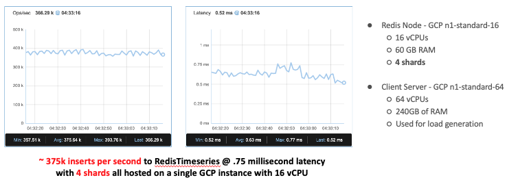

# Redis-Digital-Banking
Provides a quick-start example of using Redis with springBoot with Banking structures.  Digital Banking uses an API microservices approach to enable high speed requests for account, customer and transaction information.  As seem below, this data is useful for a variety of business purposes in the bank.
<a href="" rel="Digital Banking"></a>

## Overview
In this tutorial, a java spring boot application is run through a jar file to support typical API calls to a REDIS banking data layer.  A redis docker configuration is included.

## Redis Advantages for this Digital Banking
 * Redis easily handles high write transaction volume
 * Redis has no tombstone issues and can upsert posted transactions over pending
 * Redis scales vertically (large nodes)  and horizontally (many nodes)
 * Redis spring crud repository automates secondary index creation and usage
 * Redis spring crud repository also allows putting TTL on the hash
 * Redis crud repository also removes index entries along with the TTL so long as notify-keyspace-events is set in redis

## Requirements
* Docker installed on your local system, see [Docker Installation Instructions](https://docs.docker.com/engine/installation/).

* When using Docker for Mac or Docker for Windows, the default resources allocated to the linux VM running docker are 2GB RAM and 2 CPU's. Make sure to adjust these resources to meet the resource requirements for the containers you will be running. More information can be found here on adjusting the resources allocated to docker.

[Docker for mac](https://docs.docker.com/docker-for-mac/#advanced)

[Docker for windows](https://docs.docker.com/docker-for-windows/#advanced)

## Links that help!

 * [spring data for redis github](https://github.com/spring-projects/spring-data-examples/tree/master/redis/repositories)
 * [spring data for redis sample code](https://www.oodlestechnologies.com/blogs/Using-Redis-with-CrudRepository-in-Spring-Boot/)
 * [lettuce tips redis spring boot](https://www.bytepitch.com/blog/redis-integration-spring-boot/)
 * [spring data Reference in domain](https://github.com/spring-projects/spring-data-examples/blob/master/redis/repositories/src/main/java/example/springdata/redis/repositories/Person.java)
 * [spring data reference test code](https://github.com/spring-projects/spring-data-examples/blob/master/redis/repositories/src/test/java/example/springdata/redis/repositories/PersonRepositoryTests.java)
 * [spring async tips](https://dzone.com/articles/effective-advice-on-spring-async-part-1)

### TTL Links
 * [Spring setup for TTL github issue](https://github.com/spring-projects/spring-data-redis/issues/1299)
 * [Spring expirations documentation](https://docs.spring.io/spring-data/redis/docs/current/reference/html/#redis.repositories.expirations)
 * [Keyspace notifications in redis](https://redis.io/docs/manual/keyspace-notifications/)
 * [Keyspace Notifications Listener](https://docs.spring.io/spring-data/redis/docs/current/api/org/springframework/data/redis/listener/KeyspaceEventMessageListener.html)
 * [TTL Redis Spring StackOverflow](https://stackoverflow.com/questions/48379229/redis-expired-indexes-are-not-deleted)

## Getting Started
* Prepare Docker environment-see the Pre-requisites section above...
* Pull this github into a directory
```bash
git clone https://github.com/jphaugla/Redis-Digital-Banking.git
```
* Refer to the notes for redis Docker images used but don't get too bogged down as docker compose handles everything except for a few admin steps on tomcat.
  * [Redis stack docker instructions](https://redis.io/docs/stack/get-started/install/docker/)
* Set the environment for Redis Host, Redis Port, etc
  * Edit scripts/setEnv.sh
```bash
source scripts/setEnv.sh
```
* Open terminal and change to the github home where you will see the docker-compose.yml file, then: 
```bash
docker-compose up -d
```
NOTE:  if running redis outside of docker, must turn on notify-keyspace-events or the index entries will not automatically delete
```bash
redis-cli
config set notify-keyspace-events KEA
```

## The spring java code
This is basic spring links
 * [Spring Redis](https://docs.spring.io/spring-data/data-redis/docs/current/reference/html/#redis.repositories.indexes)

The java code demonstrates common API actions with the data persisted in REDIS.  The java spring Boot framework mminimizes the amount of code to build and maintain this solution.  Maven is used to build the java code and the code is deployed to the tomcat server.

## Data Structures in use
<a href="" rel="Tables Structures Used"></a>
## To execute the code
(Alternatively, this can be run through intelli4j)
NOTE:  Transaction TTL is hardcoded in domain/Transaction.  Edit as needed.
The corresponding CRUD created index entries will also delete as long as redis has notify keyspace events turned on (see links)

* Compile the code
```bash
mvn package
```
*  run the jar file.   
```bash
java -jar target/redis-0.0.1-SNAPSHOT.jar
```
* Test the application from a separate terminal window.  This script uses an API call to generate sample banking customers, accounts and transactions.  It uses Spring ASYNC techniques to generate higher load.  A flag chooses between running the transactions pipelined in Redis or in normal non-pipelined method.
```bash
./scripts/generateData.sh
```
Shows a benchmark test run of  generateData.sh on GCP servers
<a href="" rel="Generate Data Benchmark"></a>

* Investigate the APIs in ./scripts
  * addTag.sh - add a tag to a transaction.  Tags allow user to mark  transactions to be in a buckets such as Travel or Food for budgetary tracking purposes
  * generateLots.sh - for server testing to generate higher load levels.  Use with startAppservers.sh 
  * getByAccount.sh - find transactions for an account between a date range
  * getByCreditCard.sh - find transactions for a credit card  between a date range
  * getByCustID.sh - retrieve transactions for customer
  * getByEmail.sh - retrieve customer record using email address
  * getByMerchant.sh - find all transactions for an account from one merchant for date range
  * getByMerchantCategory.sh - find all transactions for an account from merchant category for date range
  * getByNamePhone.sh - get customers by phone and full name.
  * getByPhone.sh - get customers by phone only
  * getByStateCity.sh - get customers by city and state
  * getByZipLastname.sh -  get customers by zipcode and lastname.
  * getReturns.sh - get returned transactions count by reason code
  * getTags.sh - get all tags on an account
  * getTransaction.sh - get one transaction by its transaction ID
  * getTransactionStatus.sh - see count of transactions by account status of PENDING, AUTHORIZED, SETTLED
  * saveAccount.sh - save a sample account
  * saveCustomer.sh - save a sample customer
  * saveTransaction.sh - save a sample Transaction
  * startAppservers.sh - start multiple app server instances for load testing
  * testPipeline.sh - test pipelining
  * updateTransactionStatus.sh - generate new transactions to move all of one transaction Status up to the next transaction status. Parameter is target status.  Can choose SETTLED or POSTED.  
## Redis CRUD indexing strategy
Very exciting that using the CRUD repository, a field in the java class with the Indexed annotation is treated as an index.
<a href="" rel="Spring Indexes"></a>
### User class
Note this same RedisHash annotation is used in the Transaction class to also set a TTL automatically
```bash
@RedisHash("user")
public class User {
	private @Id String id;
	private @Indexed String firstName;
	private String middleName;
	private @Indexed String lastName;
	private String roleName;
}
```
#### hash created with key of user:1
for a user with an id=1, This is stored in a Hash with a key of user:1
(this is stored in a hash and not in a json format but displaying in json)
```json
{"_class":"com.jphaugla.domain.User","id":"1","firstName":"Jason","middleName":"Paul","lastName":"Haugland","roleName":"CEO"}
```
#### Set for each unique key called user:1:idx
holds all indexed columns with the column value
Since firstName and lastName are indexed, two elements are added to this set with the key value for each index.  
```bash
user:1:idx
	user:firstName:Jason
	user:lastName:Haugland
```
#### Set with each index value  user:firstName:Jason
Then user:firstName:Jason is a set holding the user idx of each user with a first name of jason.  User 1 is Jason Haugland so 1 is in the set.  User 2 is Jason Smith so user 2 is in this set.
```bash
user:firstName:Jason
	1
	2
```
#### Set with each index value user:lastName:Haugland 
Holds the user idx of each user with a last name of Haugland.  User 5 is Caterhine Haugland so user 5 is in this set.
```bash
user:lastName:Haugland
	1
	5
```
#### Set with all the user ids <b>user</b> 
```bash
user
	1
	2
	5
```
### Query using index columns firstname and Lastname 
```bash
SINTER user:firstName:Jason "user:lastName:Haugland"  # returns 1
HGETALL user:1
```
